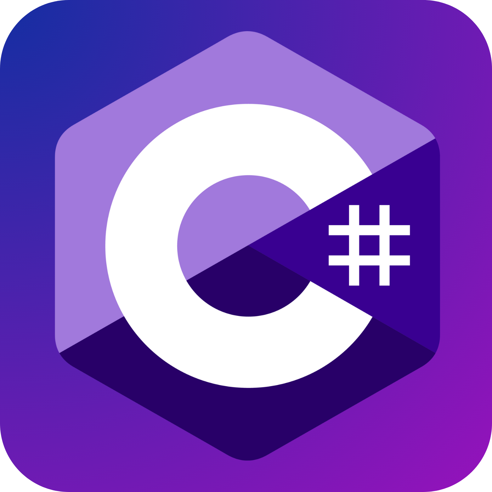

 
<h2 align="center">
    
</h2>

 
  

    <h2 align="center">⚒️ Languages & Tools ⚒️</h2>
    
    
    
    
    
    
    
    
    
    
    
   

     
    
    
    
    
<!-- -->

 

  
  

 
<h2 align="center">🐍 My Contributions 🐍</h2>

  

 
  
 
    
  

    

<!-- <h2 align="center">⚡ Stats ⚡</h2>
 

  
  
   
  

 -->

<!--
trechds/trechds is a ✨ special ✨ repository because its README.md (this file) appears on your GitHub profile.

Here are some ideas to get you started:
- 💼 I’m currently working at Bloom</li>
- 👨🏻‍🎓 Studying at Brigham Young University-Idaho</li>
- 🌱 Current learning C# and JavaScript</li>
- 🔭 Looking forward to work as a Full Stack Developer</li>
- 👯 I’m looking to collaborate on ...
- 🤔 I’m looking for help with ...
- 💬 Ask me about ...
- 📫 How to reach me: ...
- 😄 Pronouns: ...
- ⚡ Fun fact: ...
-->
